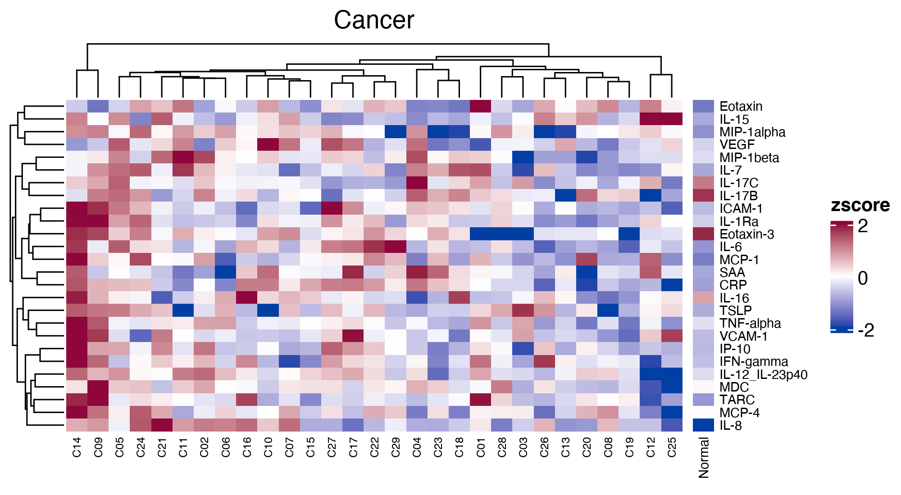
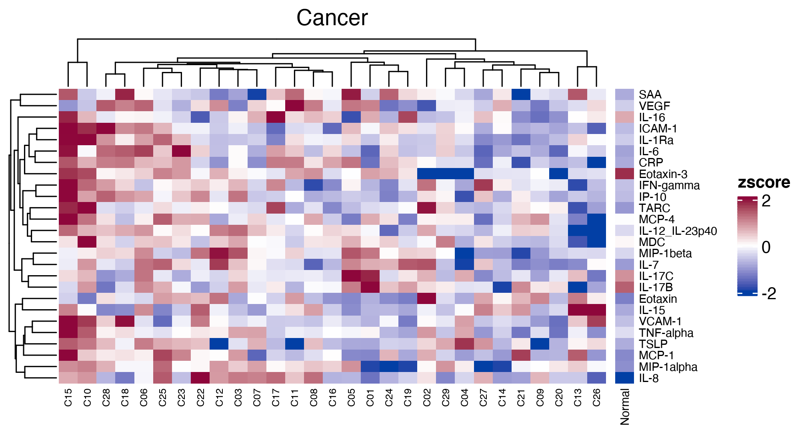

```{r setup, include=FALSE}
knitr::opts_chunk$set(echo = TRUE)
```

# Preprocessing

```{r deg, echo=TRUE}
  suppressMessages(library(limma))
  suppressMessages(library(tidyverse))
  suppressMessages(library(edgeR))
  suppressMessages(library(stringr))
  suppressMessages(library(DT))
  suppressMessages(library(EnhancedVolcano))
  suppressMessages(library(cowplot))
  suppressMessages(library(gridExtra))
  suppressMessages(library(stringr))


  workDir <- '/Users/angelmg/Documents/nci_vb_git/bergamaschi_pfizer_cancer'
  setwd(workDir)

  #Read in data
  df.cancer <- read.delim(file = file.path(workDir,"output","processed_data.csv"), sep = ',',
                 header = TRUE)
  
  # Format healthy individuals
  df.healthy <- read.delim(file = "https://github.com/NCI-VB/felber_covid_vaccine/raw/main/results/naive_dataset.csv", sep = ',', header = TRUE, row.names = 1)
  colnames(df.healthy) <- gsub("__","_",colnames(df.healthy))
  df.healthy <- as.data.frame(t(df.healthy))
  df.healthy$patient_id <- apply(array(rownames(df.healthy)), 1, function(z) unlist(str_split(z,"_"))[1])
  df.healthy$timepoint  <- apply(array(rownames(df.healthy)), 1, function(z) unlist(str_split(z,"_"))[2])  
  
  new_ids <- paste0("N",str_pad(1:length(unique(df.healthy$patient_id)), width = 2, pad = "0"))
  names(new_ids) <- unique(df.healthy$patient_id)
  
  df.healthy <- df.healthy %>% mutate(new_id = paste(new_ids[patient_id],timepoint, sep = "_"))
  row.names(df.healthy) <- df.healthy$new_id
  
  remove_columns <- c("patient_id", "timepoint", "new_id")
  df.healthy <- df.healthy[!colnames(df.healthy) %in% remove_columns]
  df.healthy <- t(df.healthy)
  
  row.names(df.healthy) <- gsub("IL-12IL-23p40", "IL-12_IL-23p40",row.names(df.healthy))
  row.names(df.healthy) <- gsub("VEGF-A", "VEGF",row.names(df.healthy)) 
  
  analytes_of_interest <- intersect(row.names(df.healthy), row.names(df.cancer))
  row.names(df.healthy)[!row.names(df.healthy) %in% analytes_of_interest]
  # "IL-3"
  row.names(df.cancer)[!row.names(df.cancer) %in% analytes_of_interest]
  # "IL-10", "IL-17A","IL-17D","IL-27","MIP-3alpha" 
  
  df.healthy <- df.healthy[analytes_of_interest, ]
  df.cancer <- df.cancer[analytes_of_interest, ]
  
  df <- cbind(df.healthy,df.cancer)

```

# Vaccination 1 Heatmap

```{r heatmap_comparison}

  suppressMessages(library(ComplexHeatmap))
  suppressMessages(library(circlize))

  df.day1 <- df[,grepl("_D1$",colnames(df),ignore.case = TRUE)]
  df.day1.c <- df.day1[,grepl("^C",colnames(df.day1))]
  df.day1.n <- df.day1[,grepl("^N",colnames(df.day1))]
  
  colnames(df.day1.c) <- gsub("_D1","",colnames(df.day1.c))
  colnames(df.day1.n) <- gsub("_d1","",colnames(df.day1.n))
  
  df.day1.n <- as.data.frame(rowMeans(df.day1.n, na.rm = TRUE))
  colnames(df.day1.n)[1] <- "Normal"
  
  data.mean <- apply(df.day1.c,1,function(z) mean(z, na.rm = TRUE))
  data.sd   <- apply(df.day1.c,1,function(z) sd(z, na.rm = TRUE))
  
  for(i in 1:nrow(df.day1.c)){
    m <- data.mean[i]
    s <- data.sd[i]
    
    df.day1.c[i,] <- (df.day1.c[i,]-m)/s
    df.day1.n[i,1] <- (df.day1.n[i,1]-m)/s
  }
  
  col_fun = colorRamp2(c(-2, 0, 2), c("#023FA5", "white", "#8E063B")) 

  #Annotations
  imageWidth = 2000
  imageHeight = 1100
  dpi = 300

  png(
    filename="plots/day1_complex_heatmap.png",
    width=imageWidth,
    height=imageHeight,
    units="px",
    pointsize=4,
    bg="white",
    res=dpi,
    type="cairo")
  hm1 <- Heatmap(as.matrix(df.day1.c),
              name = "zscore",
              col = col_fun,
              heatmap_legend_param = list(
                at = c(-2, 0, 2)),
              show_heatmap_legend=TRUE,
              column_labels = colnames(df.day1.c),
              column_names_gp = grid::gpar(fontsize = 6),
              row_names_gp = grid::gpar(fontsize = 8),
              column_title = "Cancer"
              )
  hm2 <- Heatmap(as.matrix(df.day1.n),
              name = "Healthy",
              col = col_fun,
              heatmap_legend_param = list(
                at = c(-2, 0, 2)),
              show_heatmap_legend=FALSE,
              column_labels = colnames(df.day1.n),
              column_names_gp = grid::gpar(fontsize = 7),
              row_names_gp = grid::gpar(fontsize = 7)
              #column_title = "Healthy"
              )
  hm <- hm1 + hm2
  draw(hm, main_heatmap = "zscore", row_dend_side = "left")
  
  null_var <- dev.off()
  
```

# Vaccination 2 Heatmap

```{r heatmap_comparison_d22}

  df.day2 <- df[,grepl("_D22$",colnames(df),ignore.case = TRUE)]
  df.day2.c <- df.day1[,grepl("^C",colnames(df.day2))]
  df.day2.n <- df.day1[,grepl("^N",colnames(df.day2))]
  
  colnames(df.day2.c) <- gsub("_D1","",colnames(df.day2.c))
  colnames(df.day2.n) <- gsub("_d1","",colnames(df.day2.n))
  
  df.day2.n <- as.data.frame(rowMeans(df.day2.n, na.rm = TRUE))
  colnames(df.day2.n)[1] <- "Normal"
  
  data.mean <- apply(df.day2.c,1,function(z) mean(z, na.rm = TRUE))
  data.sd   <- apply(df.day2.c,1,function(z) sd(z, na.rm = TRUE))
  
  for(i in 1:nrow(df.day2.c)){
    m <- data.mean[i]
    s <- data.sd[i]
    
    df.day2.c[i,] <- (df.day2.c[i,]-m)/s
    df.day2.n[i,1] <- (df.day2.n[i,1]-m)/s
  }
  
  col_fun = colorRamp2(c(-2, 0, 2), c("#023FA5", "white", "#8E063B")) 

  #Annotations
  imageWidth = 2000
  imageHeight = 1100
  dpi = 300

  png(
    filename="plots/day22_complex_heatmap.png",
    width=imageWidth,
    height=imageHeight,
    units="px",
    pointsize=4,
    bg="white",
    res=dpi,
    type="cairo")
  hm1 <- Heatmap(as.matrix(df.day2.c),
              name = "zscore",
              col = col_fun,
              heatmap_legend_param = list(
                at = c(-2, 0, 2)),
              show_heatmap_legend=TRUE,
              column_labels = colnames(df.day1.c),
              column_names_gp = grid::gpar(fontsize = 6),
              row_names_gp = grid::gpar(fontsize = 8),
              column_title = "Cancer"
              )
  hm2 <- Heatmap(as.matrix(df.day2.n),
              name = "Healthy",
              col = col_fun,
              heatmap_legend_param = list(
                at = c(-2, 0, 2)),
              show_heatmap_legend=FALSE,
              column_labels = colnames(df.day1.n),
              column_names_gp = grid::gpar(fontsize = 7),
              row_names_gp = grid::gpar(fontsize = 7)
              #column_title = "Healthy"
              )
  hm <- hm1 + hm2
  draw(hm, main_heatmap = "zscore", row_dend_side = "left")
  
  null_var <- dev.off()
  
```

# Session Info

```{r session, echo=FALSE}

sessionInfo()
```